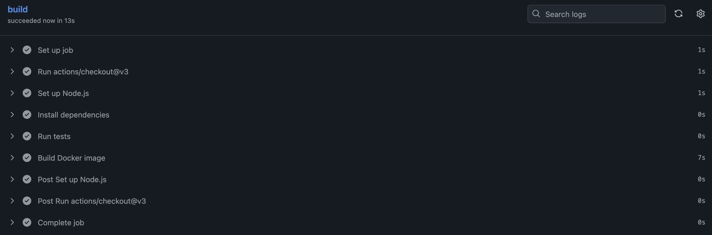

# CI/CD Pipeline with GitHub Actions + Docker

This is a simple Node.js app with a Dockerfile and GitHub Actions CI pipeline that:

- Runs on push to `main`
- Installs dependencies
- Runs tests (mock placeholder)
- Builds a Docker image

Run locally:
```bash
docker-compose up --build
```

