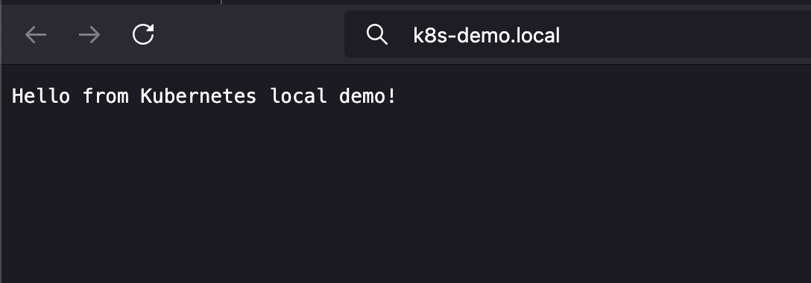

# Local Kubernetes Environment Demo

This demo runs a simple Node.js app in a local Kubernetes environment using Minikube or k3d.

## 💡 Features
- Local Docker build and deploy (no remote image pull)
- Kubernetes Deployment, Service, and Ingress
- Custom domain routing via `k8s-demo.local`
- Scalable pod replicas

## 🧪 How to Run
```bash
# 1. Start Minikube or k3d
minikube start  # or k3d cluster create

# 2. Enable Ingress if using Minikube
minikube addons enable ingress

# 3. Build local image
eval $(minikube docker-env)
docker build -t k8s-demo-app:latest .

# 4. Apply K8s manifests
kubectl apply -f k8s/

# 5. Add to /etc/hosts
127.0.0.1 demo.local

# 6. Test in browser
http://demo.local
```

